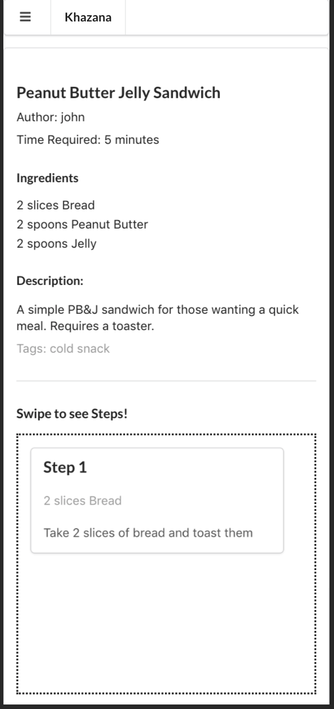
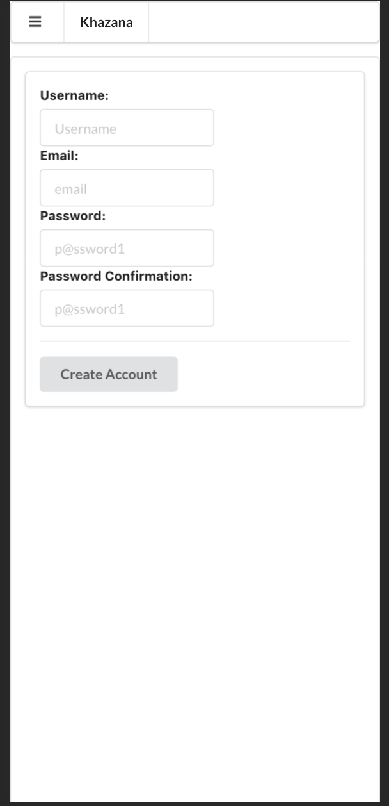
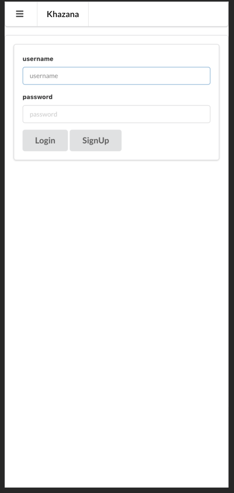
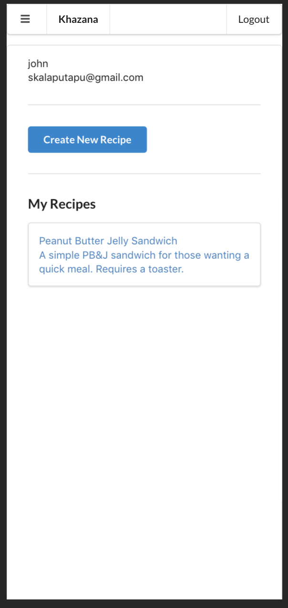

# Khazana
<b>A recipe sharing web application designed for easy-viewing on small screens.</b>

After struggling to learn how to cook from current recipe sharing sites I decided to make my own web application that would be friendly for mobile devices. A lot of people I know cook by looking at recipes on their mobile devices and a lot of sites are not fit for mobile. Pinching and zooming and dealing with walls of text and people's life stories while reading the instructions of a recipe are two major annoyances I tried to get around when designing my application. 

This project was made during my final section of the FlatIron School Software Developer Bootcamp. 

The Timeline was 2 weeks.

My notes/planning:
https://docs.google.com/document/d/1zc9DncANSV5YZf480oMcytikV6lw36Jdp-iRif8W2f4/edit?usp=sharing

Trello Board I made:
https://trello.com/b/GFOpzSXw/khazana-v2

Document with Learning lessons: [Khazana Notes] (/Khazana Notes.docx)

## Author

Srikant Kumar Kalaputapu

## Tech/framework used

This is a Single-Page Application.

<b>Built with</b>
- [React](https://reactjs.org/)
- [Redux](https://redux.js.org/)
- [Ruby on Rails](https://rubyonrails.org/)
- [Semantic UI](https://react.semantic-ui.com/)
- [JWT](https://jwt.io/)

## Features

- Allows users to create an account
- Allows users to create a recipe
- Allows users to view recipes that are mobile friendly using Semantic UI and SwipeableViews
- Allows users to see all recipes


## Possible future features

- Image upload for both thumbnail and each steps for a recipe
- Update and delete for recipes.
- ADD testing suite
- Change the ingredients storage on the back end.
- Change JWT Token storage
- Remove Redux for creation form
- Upload to Heroku


## How to use

Requires Git, Ruby, Bundler, and Node Package Manager

In Terminal/Console:

```
 # Clone the repo
 $ git clone git@github.com:KSriki/Khazana.git
 
 # go into application
 $ cd Khazana
 
 # navigate to backend
 $ cd back-end
 $ cd cooking_backend
 
 # setup backend
 $ bundle install
 
 # create the database
 $ rails db:create
 
 # migrate the database (add tables etc.)
 $ rails db:migrate

 # seed the database with base data
 $ rails db:seed

 # run the server
 $ rails s
 
 ## In another terminal window set up front end
 $ cd front-end
 $ cd cooking_frontend
 
 # Install the packages
 $ npm install
 
 # start the server
 $ npm start
 
 # Type and enter 'yes' when asked for different port (3000 is taken by the backend)
 
```
## Screenshots

| Homepage  | Recipe | 
| ------------- | ------------- | 
|    |   | 

| Signup | Login | Profile |
| ------------- | ------------- | ------------- |
|  |  |  |


Creation of a Recipe:

| Page 1 | Page 2 | Page 3 |
| ------------- | ------------- | ------------- |  
|  |  |  |


